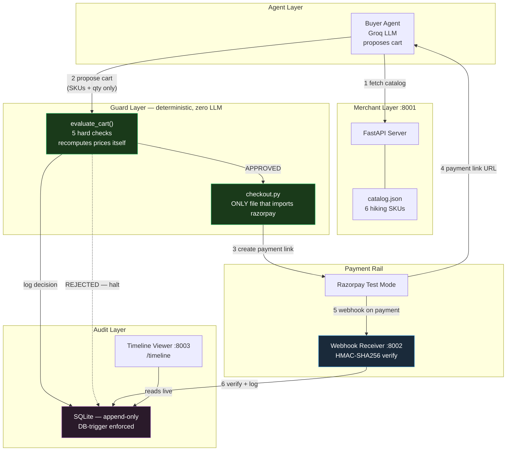

# Agent Checkout — Bounded, Gated, Audited AI Commerce

An AI agent that shops autonomously, proposing purchases from a merchant catalog, with deterministic guardrails that enforce hard limits the model cannot talk its way past. Every action is logged to an append-only audit trail; every payment is confirmed via cryptographically verified webhooks.

**The principle:** *The model proposes. The guard disposes. For any model.*

Built for the Razorpay AI Buildathon, Track 01 — AI Growth & Agentic Commerce.

---

## Architecture



<details>
<summary>Architecture (text version)</summary>

```
Buyer Agent (Groq LLM)
    │
    │ 1. fetches catalog (HTTP GET)
    ▼
Merchant Server :8001 ──── catalog.json (6 hiking SKUs)
    │
    │ 2. proposes cart (SKUs + qty only — nothing else trusted)
    ▼
GUARD — evaluate_cart() — deterministic, zero LLM
    ├── recomputes prices from catalog (never from agent)
    ├── checks: cart not empty, merchant allowed, SKUs valid, qty sane, budget
    │
    ├── REJECTED → halt, logged, NO payment call
    │
    └── APPROVED → checkout.py (ONLY file that imports razorpay)
                        │
                        │ 3. creates payment link
                        ▼
                  Razorpay Test Mode
                        │
                        ├── 4. returns payment link URL
                        │
                        └── 5. POST webhook on payment
                              │
                              ▼
                  Webhook Receiver :8002
                  HMAC-SHA256 signature verify
                        │
                        │ 6. verified event logged
                        ▼
                  Audit Trail (SQLite)
                  append-only (DB-trigger enforced)
                        │
                        ▼
                  Timeline Viewer :8003
                  reads live, renders as cards
```

</details>

---

## What's bounded (hard limits enforced in code, not prompts)

| Limit | Value | Enforced where |
|-------|-------|----------------|
| Budget cap | Rs.1,500 (150,000 paise) | `guard/guard.py` — recomputed from catalog prices |
| Merchant allow-list | `{"trailkart"}` only | `guard/guard.py` — hardcoded, not configurable by agent |
| Max quantity per item | 5 | `guard/guard.py` |
| Max cart lines | 10 | `guard/guard.py` |
| Price source of truth | `catalog.json` on disk | Guard reads catalog directly, never trusts agent's claimed prices |
| Razorpay import | `guard/checkout.py` only | Structural — no other file can touch the payment API |

The model never sees price data, never computes totals, never calls payment APIs. It proposes SKUs and quantities. The guard does everything else.

---

## What's gated (explicit checkpoints before money moves)

1. **Guard checkpoint** — `evaluate_cart()` runs five deterministic checks before any payment call. Rejected carts never reach Razorpay.
2. **Structural gate** — only `guard/checkout.py` imports razorpay. The agent cannot call payment APIs even if compromised.
3. **Human gate** — the payment link opens in a browser; a person confirms the test UPI/card. Mirrors how Razorpay's real agentic pilots work.
4. **Trust gate** — webhooks are HMAC-SHA256 verified before any payment confirmation is trusted. Forged callbacks return 400 and are logged as hostile.

---

## What still breaks (honest limitations)

- Single merchant only — catalog is hardcoded, not discovered dynamically
- No refund flow — payments can be created and captured, not reversed
- Test-mode keys — no real money moves; test UPI IDs and test cards only
- Webhook URL is ephemeral — ngrok free tier gives a new URL on restart
- No multi-currency — INR only
- Agent doesn't comparison-shop — reads one catalog, doesn't negotiate or search multiple merchants
- Mission state is stateless — each run is independent; no session persistence
- Guard allow-list is static — not configurable per-mission

---

## Quickstart

```bash
# Clone
git clone https://github.com/kalvaharshith/agent-checkout.git
cd agent-checkout

# Setup
python -m venv .venv
.venv\Scripts\activate          # Windows
# source .venv/bin/activate     # macOS/Linux
pip install -r requirements.txt

# Add secrets to .env:
#   RAZORPAY_KEY_ID=rzp_test_...
#   RAZORPAY_KEY_SECRET=...
#   GROQ_API_KEY=gsk_...
#   WEBHOOK_SECRET=agentcheckout_2026_secret

# 1. Start the merchant server
python -m uvicorn merchant.app:app --port 8001 --reload

# 2. Run the buyer agent (separate terminal)
python scripts/run_buyer.py

# 3. Test the guard (no server needed)
python scripts/test_guard.py

# 4. Full end-to-end checkout
python scripts/run_checkout.py

# 5. View the audit timeline
python -m uvicorn viewer.app:app --port 8003 --reload
# Open http://localhost:8003/timeline
```

---

## Tech stack

| Component | Technology |
|-----------|-----------|
| Language | Python 3.11+ |
| Web framework | FastAPI + uvicorn |
| Database | SQLite (append-only, trigger-enforced) |
| LLM | Groq (openai/gpt-oss-120b) via OpenAI-compatible API |
| Payments | Razorpay Test Mode (Payment Links + Webhooks) |
| Tunneling | ngrok (for webhook testing) |

---

## File structure

```
agent-checkout/
├── merchant/          # Agent-readable catalog + FastAPI server (:8001)
│   ├── catalog.json   # 6 hiking SKUs with prices in paise
│   └── app.py
├── agent/             # Buyer agent (Groq-powered, proposes carts)
│   └── buyer.py
├── guard/             # Deterministic guard + checkout
│   ├── guard.py       # evaluate_cart() — 5 hard checks
│   └── checkout.py    # ONLY file that imports razorpay
├── audit/             # Append-only SQLite audit trail
│   └── audit.py       # DB-trigger enforced (no UPDATE/DELETE)
├── webhooks/          # HMAC-SHA256 webhook receiver (:8002)
│   └── app.py
├── viewer/            # Timeline UI for the audit trail (:8003)
│   └── app.py
├── scripts/           # Runners and tests
│   ├── create_test_order.py
│   ├── run_buyer.py
│   ├── test_guard.py
│   ├── run_checkout.py
│   └── show_audit.py
├── .env               # Secrets (never committed)
├── .gitignore
├── requirements.txt
└── README.md
```

---

## Design decisions (for the panel)

**Why deterministic, not prompted?**
A prompt is a suggestion. The model can be jailbroken, confused, or injected. A function is a wall. The guard never reads the model's reasoning — it receives SKUs and quantities, and that's all.

**Why recompute prices?**
The model might hallucinate a cheaper price. The guard looks up prices from the catalog itself. The model's claimed total is never used.

**Why append-only at the DB level?**
Convention can be violated under pressure. A database trigger that aborts UPDATE and DELETE cannot be argued with — even by your own future self at 3 AM.

**Why HMAC verification on webhooks?**
Anyone can POST to a webhook URL. The signature proves the message came from Razorpay and wasn't altered. Without it, you'd be trusting forged payment confirmations.

**Why only one file imports razorpay?**
Structural separation. If the agent is compromised via prompt injection, it still can't call payment APIs because the import doesn't exist in its code path. The gate is architectural, not behavioral.

---

## Commit history

This repo was built milestone by milestone (M0 through M6), with each commit representing a working, demo-able increment. No single-dump commits.

